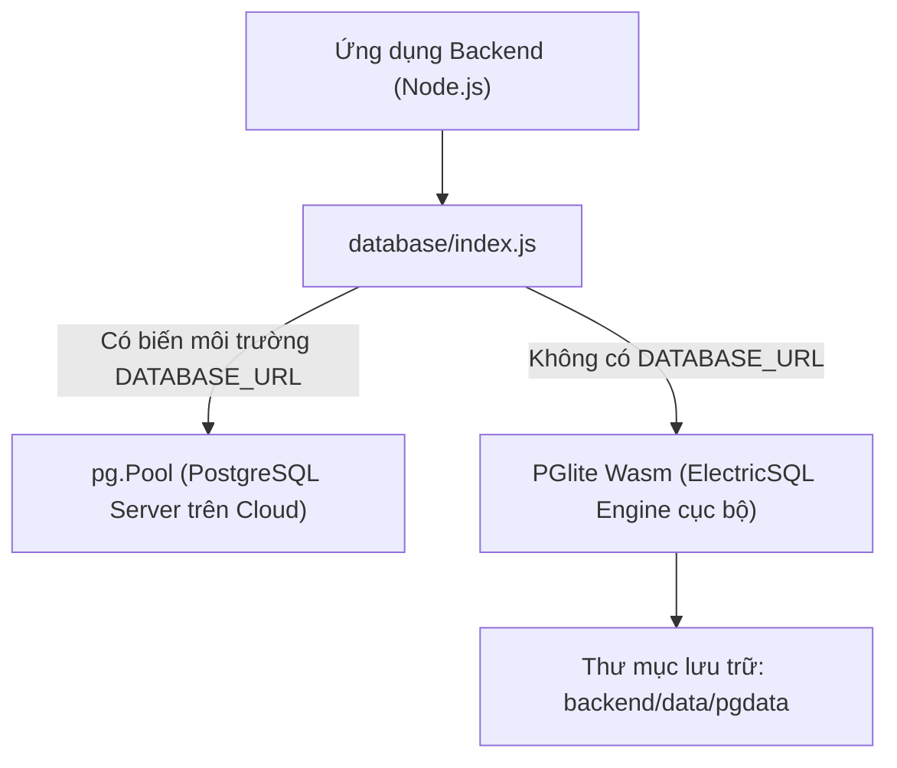
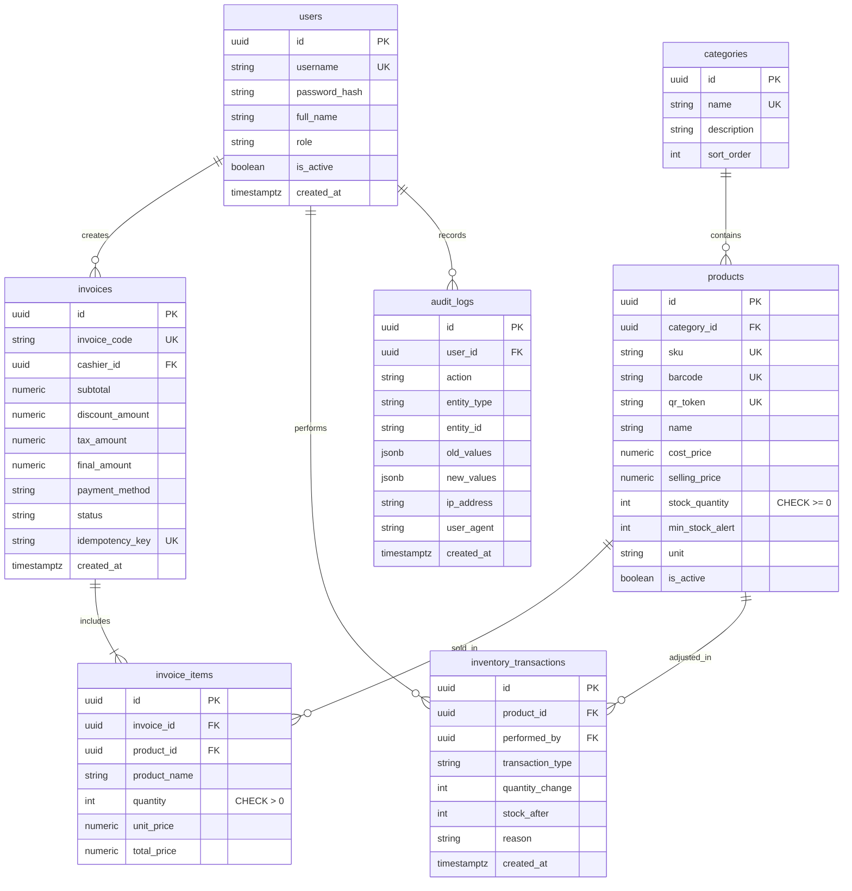

# 01. Kiến Trúc Cơ Sở Dữ Liệu & Mô Hình Hóa Dữ Liệu (Database Architecture)

Hệ thống sử dụng cơ sở dữ liệu quan hệ **PostgreSQL** chuẩn doanh nghiệp, được thiết kế theo các nguyên tắc chuẩn hóa dữ liệu (3NF), đảm bảo tính toàn vẹn **ACID (Atomicity, Consistency, Isolation, Durability)** và khả năng xử lý tương tranh cao.

---

## 1. Cơ Chế Dual-Engine Connector (`database/index.js`)

Để đảm bảo hệ thống có thể chạy tức thì trên môi trường cục bộ (không cần cài đặt PostgreSQL server phức tạp) đồng thời kết nối mượt mà tới PostgreSQL trên Cloud (Render, Supabase, AWS RDS, Neon), module kết nối hỗ trợ cơ chế song song:



### Mã nguồn Adapter trừu tượng hóa:
Adapter thống nhất giao diện truy vấn `query(text, params)` và quản lý giao dịch `transaction(callback)`:
- Hỗ trợ câu lệnh SQL chuẩn PostgreSQL.
- Tự động bắt lỗi và Rollback khi có ngoại lệ phát sinh trong Transaction.
- Tự động chạy Migration khởi tạo bảng khi server khởi động (`runMigrations`).

---

## 2. Thiết Kế Lược Đồ Cơ Sở Dữ Liệu (DDL Schema)

Hệ thống bao gồm 7 bảng cốt lõi:



---

## 3. Các Ràng Buộc Bảo Vệ Dữ Liệu Quan Trọng (Constraints)

### 3.1 Ràng buộc chặn tồn kho âm (Anti-Negative Stock)
Trên bảng `products`:
```sql
CONSTRAINT check_stock_non_negative CHECK (stock_quantity >= 0)
```
> **Ý nghĩa:** Ràng buộc này nằm ở tầng Database Kernel, hoạt động như bức tường phòng thủ cuối cùng. Dù có bất kỳ lỗi logic nào ở tầng application, PostgreSQL sẽ lập tức ném lỗi ngoại lệ vi phạm CHECK constraint nếu số lượng bị giảm xuống dưới 0, bảo vệ tính đúng đắn của dữ liệu.

### 3.2 Ràng buộc giá bán và số lượng
- Bảng `products`:
  ```sql
  CONSTRAINT check_prices CHECK (cost_price >= 0 AND selling_price >= 0)
  ```
- Bảng `invoice_items`:
  ```sql
  CONSTRAINT check_item_quantity CHECK (quantity > 0)
  ```

### 3.3 Chống trùng hóa đơn qua Idempotency Key
- Bảng `invoices`:
  ```sql
  CONSTRAINT uq_invoices_idempotency_key UNIQUE (idempotency_key)
  ```
> Nếu hai request gửi cùng 1 `Idempotency-Key` cùng lúc, ràng buộc UNIQUE sẽ loại bỏ request thứ hai ở cấp độ cơ sở dữ liệu.

---

## 4. Tối Ưu Hóa Chỉ Mục (Indexes)

Hệ thống thiết lập các chỉ mục B-Tree chuyên biệt phục vụ tra cứu nhanh:
```sql
-- Tìm kiếm sản phẩm theo mã vạch và mã QR bảo mật
CREATE INDEX idx_products_barcode ON products(barcode) WHERE barcode IS NOT NULL;
CREATE INDEX idx_products_qr_token ON products(qr_token) WHERE qr_token IS NOT NULL;
CREATE INDEX idx_products_category ON products(category_id);

-- Thống kê doanh số theo ngày và nhân viên bán hàng
CREATE INDEX idx_invoices_created_at ON invoices(created_at);
CREATE INDEX idx_invoices_cashier ON invoices(cashier_id);
CREATE INDEX idx_invoices_code ON invoices(invoice_code);

-- Truy vết lịch sử kho và kiểm toán
CREATE INDEX idx_inventory_product_date ON inventory_transactions(product_id, created_at DESC);
CREATE INDEX idx_audit_logs_user_date ON audit_logs(user_id, created_at DESC);
CREATE INDEX idx_audit_logs_action ON audit_logs(action);
```

---

## 5. Dữ Liệu Khởi Tạo (Seeder Engine - `database/seed.js`)

Khi khởi tạo cơ sở dữ liệu, bộ Seeder tự động nạp:
1. **Tài khoản người dùng**:
   - `admin` (Role: `SUPER_ADMIN`)
   - `nhanvien1` (Role: `ADMIN` / Cashier)
2. **Danh mục hàng hóa**: Bánh kẹo, Đồ uống, Nhu yếu phẩm, Gia vị, Sữa & chế phẩm sữa.
3. **Sản phẩm mẫu**: Bánh ChocoPie, Mì Hảo Hảo, Coca Cola, Sữa chua Vinamilk, Dầu ăn Simply, Nước mía (sản phẩm không có mã QR), v.v.
4. **436 Hóa đơn mẫu (Historical Data)**:
   - Được phân bổ ngẫu nhiên theo mô hình tuần hoàn mùa vụ (Seasonality) trong suốt 12 tháng qua.
   - Dữ liệu này là nền tảng thực tế giúp mô hình Machine Learning Holt-Winters tự học và đưa ra dự báo doanh thu chính xác ngay khi hệ thống vừa khởi chạy.
