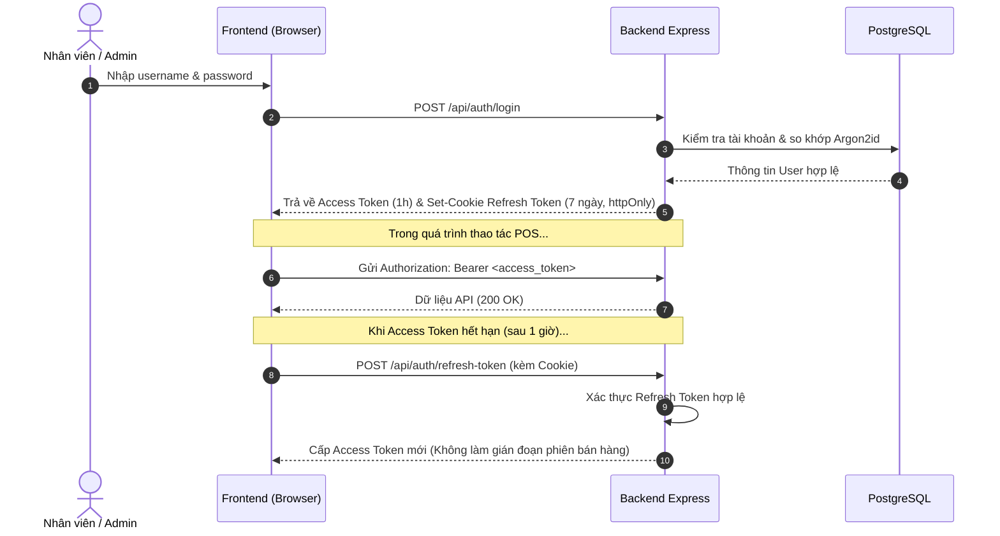

# 02. Cơ Chế Xác Thực, Phân Quyền & Bảo Mật (Authentication & RBAC)

Hệ thống được thiết kế với chuẩn bảo mật cao cấp dành cho mô hình chuỗi hoặc cửa hàng nhiều nhân viên bán hàng cùng lúc.

---

## 1. Cơ Chế Băm Mật Khẩu (Password Hashing - `utils/password.js`)

Hệ thống ưu tiên sử dụng thuật toán **Argon2id** (thuật toán chiến thắng tại Password Hashing Competition), với cơ chế fallback tự động sang **Bcrypt (12 rounds)**:

```javascript
// Cấu hình Argon2id chuẩn OWASP
const ARGON2_OPTIONS = {
  type: argon2.argon2id,
  memoryCost: 2 ** 16, // 64 MB bộ nhớ
  timeCost: 3,         // 3 vòng lặp
  parallelism: 1       // 1 luồng
};
```

### Ưu điểm vượt trội:
- **Kháng GPU/ASIC Cracking**: Tốn nhiều bộ nhớ RAM khi băm, ngăn chặn các cuộc tấn công brute-force dùng phần cứng đào coin hoặc card đồ họa mạnh.
- **Salt ngẫu nhiên**: Mỗi mật khẩu được tự động kèm theo một chuỗi salt bảo mật riêng biệt trước khi lưu vào cơ sở dữ liệu.

---

## 2. Quản Lý Phiên Đăng Nhập & JWT Token Rotation (`utils/jwt.js`)

Hệ thống áp dụng cơ chế xác thực kép **Access Token + Refresh Token**:



### Chi tiết cấu hình JWT:
- **Access Token**:
  - Thời hạn: `1 hour`
  - Payload: `{ id, username, role, fullName }`
  - Được truyền qua header: `Authorization: Bearer <token>`
- **Refresh Token**:
  - Thời hạn: `7 days`
  - Lưu trữ: `HttpOnly`, `SameSite: Strict`, `Secure` (trong môi trường Production HTTPS), ngăn chặn triệt để lỗ hổng XSS đánh cắp token.

---

## 3. Ma Trận Phân Quyền (RBAC Permission Matrix)

Hệ thống chia làm 3 cấp bậc vai trò thông qua middleware `authorizeRoles(...)`:

| Quyền hạn / Chức năng | `SUPER_ADMIN` | `ADMIN` (Quản lý) | `STAFF` (Thu ngân) |
|:---|:---:|:---:|:---:|
| Bán hàng POS, Quét QR, In Bill | ✅ | ✅ | ✅ |
| Xem danh mục & tồn kho sản phẩm | ✅ | ✅ | ✅ |
| Nhập kho hàng hóa mới (`IMPORT`) | ✅ | ✅ | ❌ |
| Điều chỉnh kiểm kê kho (`ADJUST`) | ✅ | ✅ | ❌ |
| Thêm/Sửa/Xóa sản phẩm, danh mục | ✅ | ✅ | ❌ |
| Xem bảng điều khiển & Báo cáo doanh số | ✅ | ✅ | ❌ |
| Hỏi đáp trợ lý kinh doanh AI | ✅ | ✅ | ❌ |
| Điều chỉnh/Sửa hóa đơn cũ đã xuất | ✅ | ❌ | ❌ |
| Quản lý tài khoản, phân quyền nhân viên | ✅ | ❌ | ❌ |
| Xem nhật ký kiểm toán hệ thống (Audit Logs)| ✅ | ❌ | ❌ |

---

## 4. Bảo Vệ Tấn Công Brute-Force (Rate Limiter - `middleware/rateLimiter.js`)

Để ngăn chặn hacker thử mật khẩu tự động:
- Endpoint nhạy cảm: `POST /api/auth/login`
- Giới hạn: Tối đa **5 lần thử thất bại trong 15 phút** cho mỗi địa chỉ IP.
- Khi vượt ngưỡng: Lập tức trả về mã lỗi HTTP `429 Too Many Requests` kèm thông báo tiếng Việt: *"Quá nhiều lần thử đăng nhập không hợp lệ. Vui lòng thử lại sau 15 phút."*
