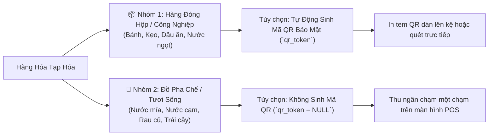

# 03. Quản Lý Sản Phẩm, Danh Mục & Hệ Thống Mã QR (Products & QR Engine)

Quản lý hàng hóa là trung tâm của hệ thống tạp hóa. Module này xử lý tối ưu hóa danh mục, sản phẩm đóng gói có mã QR lẫn sản phẩm pha chế/tự chế biến không có mã.

---

## 1. Phân Loại Hàng Hóa Linh Hoạt (Hai Kịch Bản Nghiệp Vụ)

Theo đặc thù cửa hàng tạp hóa thực tế, hệ thống hỗ trợ 2 nhóm hàng hóa chính:



### 1.1 Sản phẩm có mã QR / Barcode:
- Hệ thống hỗ trợ cả mã vạch chuẩn nhà sản xuất (`barcode`, ví dụ EAN-13) và mã QR nội bộ cửa hàng (`qr_token`).
- Token QR được sinh ngẫu nhiên bảo mật dạng UUIDv4 hoặc chuỗi ký tự đặc trưng (`utils/idGenerator.js`), tránh trùng lặp.
- Hỗ trợ in tem nhãn QR trực tiếp từ giao diện Quản lý sản phẩm.

### 1.2 Sản phẩm không dùng mã QR:
- Các sản phẩm như **Nước mía**, **Nước cam**, **Đồ uống tự pha**: Cho phép để trống mã vạch và tắt tùy chọn sinh mã QR.
- Trên giao diện POS di động, các sản phẩm này hiển thị dạng thẻ cảm ứng to rõ, thu ngân bấm chọn thêm vào giỏ hàng trong 0.5 giây mà không cần quét camera.

---

## 2. Bảo Toàn Dữ Liệu Lịch Sử (Soft Delete)

Để bảo đảm các hóa đơn bán hàng trong quá khứ không bị lỗi liên kết dữ liệu khi một sản phẩm ngừng kinh doanh:
- Hệ thống **tuyệt đối không dùng câu lệnh `DELETE FROM products`**.
- Thay vào đó, sử dụng cờ trạng thái `is_active = FALSE`:
  ```sql
  UPDATE products SET is_active = FALSE, updated_at = NOW() WHERE id = $1;
  ```
- **Kết quả:**
  - Sản phẩm ngừng kinh doanh sẽ tự động ẩn khỏi danh sách tìm kiếm bán hàng POS.
  - Các hóa đơn xuất từ trước vẫn hiển thị đầy đủ tên món, giá bán gốc và số lượng lịch sử phục vụ kiểm toán và báo cáo thuế.

---

## 3. Cấu Trúc Bảng Dữ Liệu Sản Phẩm & Danh Mục

### Bảng `categories` (Danh mục)
- `id`: UUID khóa chính.
- `name`: Tên danh mục (ví dụ: "Bánh Kẹo", "Nước Giải Khát", "Gia Vị").
- `description`: Mô tả chi tiết danh mục.
- `sort_order`: Thứ tự ưu tiên hiển thị trên thanh cuộn menu.

### Bảng `products` (Sản phẩm)
- `sku`: Mã SKU quản lý nội bộ (ví dụ: `BCP-001`).
- `barcode`: Mã vạch thương mại (ví dụ: `8934567890123`).
- `qr_token`: Mã băm QR bảo mật nội bộ.
- `name`: Tên sản phẩm đầy đủ.
- `cost_price`: Giá nhập hàng (Giá vốn) phục vụ tính toán lợi nhuận gộp.
- `selling_price`: Giá bán lẻ niêm yết cho khách.
- `stock_quantity`: Số lượng hàng thực tế trong kho (luôn `>= 0`).
- `min_stock_alert`: Ngưỡng cảnh báo tồn kho tối thiểu (ví dụ: còn dưới 5 cái thì báo động vàng/đỏ).
- `unit`: Đơn vị tính (`Gói`, `Hộp`, `Chai`, `Lon`, `Ly`, `Kg`).

---

## 4. Cơ Chế Quét & Giải Mã QR Tại Quầy Thu Ngân

Giao diện POS tích hợp thư viện `html5-qrcode` truy cập Camera điện thoại/máy tính bảng:
1. Thu ngân hướng camera về phía mã QR hoặc mã vạch của sản phẩm.
2. Bộ giải mã trích xuất chuỗi nội dung.
3. Client gửi request `GET /api/products/lookup?code=<decoded_token>`.
4. Cơ sở dữ liệu sử dụng chỉ mục `idx_products_qr_token` hoặc `idx_products_barcode` để trả về thông tin sản phẩm trong chưa đầy 50ms.
5. Sản phẩm tự động cộng dồn vào giỏ hàng (`CartContext`) và phát âm thanh phản hồi tức thì.
