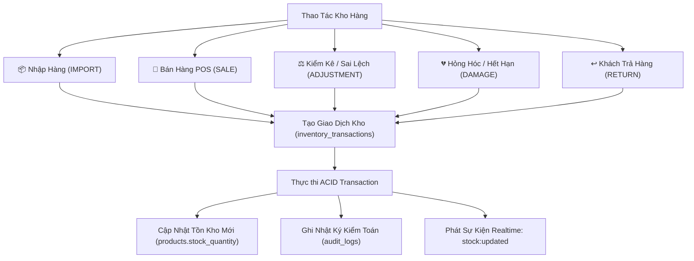

# 04. Quản Lý Tồn Kho & Lịch Sử Biến Động Kho (Inventory Management)

Module Kho hàng quản lý toàn bộ vòng đời lưu thông của hàng hóa từ lúc nhập hàng từ nhà phân phối đến khi bán cho khách hàng hoặc điều chỉnh hao hụt, hư hỏng.

---

## 1. Nguyên Tắc Quản Lý Kho Bất Biến (Double-Entry Inventory Ledger)

Mọi biến động tăng hoặc giảm tồn kho **bắt buộc phải sinh ra một bản ghi giao dịch kho** trong bảng `inventory_transactions`. Hệ thống không bao giờ cập nhật thẳng cột `stock_quantity` mà không có chứng từ giải trình.



---

## 2. Các Loại Giao Dịch Kho (Transaction Types)

| Loại Giao Dịch | Chiều Biến Động | Bắt Buộc Lý Do? | Mô Tả & Nghiệp Vụ |
|:---|:---:|:---:|:---|
| `IMPORT` | Tăng (+) | Không bắt buộc | Nhập thêm hàng từ nhà cung cấp, cập nhật lại giá vốn nhập hàng mới nhất. |
| `SALE` | Giảm (-) | Tự động gắn mã HĐ | Bán hàng qua máy POS, trừ trực tiếp tồn kho khi khách thanh toán thành công. |
| `ADJUSTMENT` | Tăng/Giảm (±) | **Bắt buộc** | Kiểm kê định kỳ phát hiện thừa/thiếu hàng so với sổ sách thực tế. |
| `DAMAGE` | Giảm (-) | **Bắt buộc** | Hàng bị vỡ, rách bao bì, quá hạn sử dụng (hết date) cần xuất hủy. |
| `RETURN` | Tăng (+) | **Bắt buộc** | Khách đổi trả hàng còn nguyên tem mác hoặc hoàn trả hóa đơn. |

---

## 3. Quy Trình Nhập Kho Hàng Hóa (`services/inventoryService.js`)

Khi nhập hàng:
```javascript
// Dữ liệu đầu vào:
{
  productId: "uuid-san-pham",
  quantity: 50,
  costPrice: 15000,     // Giá nhập mới
  sellingPrice: 20000,  // Giá bán lẻ điều chỉnh (nếu có)
  reason: "Nhập hàng từ Nhà Phân Phối Masan"
}
```

### Xử lý giao dịch:
1. Mở Transaction PostgreSQL.
2. Khóa dòng sản phẩm mục tiêu: `SELECT * FROM products WHERE id = $1 FOR UPDATE`.
3. Tính toán số lượng tồn mới: `newStock = currentStock + quantity`.
4. Cập nhật bảng `products`:
   ```sql
   UPDATE products 
   SET stock_quantity = stock_quantity + $1,
       cost_price = COALESCE($2, cost_price),
       selling_price = COALESCE($3, selling_price),
       updated_at = NOW()
   WHERE id = $4;
   ```
5. Ghi vào `inventory_transactions` số lượng thay đổi (`+50`) và số tồn sau biến động.
6. Commit Transaction và phát sự kiện WebSocket tới tất cả các màn hình POS.

---

## 4. Kiểm Kê & Điều Chỉnh Kho An Toàn

Đối với các hành vi điều chỉnh do kiểm kê, hỏng hóc hoặc mất mát:
- **Kiểm tra phân quyền**: Chỉ người dùng có vai trò `SUPER_ADMIN` hoặc `ADMIN` mới được phép thao tác.
- **Ràng buộc lý do giải trình**: API từ chối nếu trường `reason` rỗng hoặc dưới 5 ký tự.
- **Bảo vệ không âm kho**: Nếu số lượng điều chỉnh làm tồn kho `< 0`, hệ thống ném ngoại lệ `INVALID_STOCK_ADJUSTMENT` và tự động rollback toàn bộ giao dịch.

---

## 5. Hệ Thống Cảnh Báo Hết Hàng (Low Stock Alert)

Trên giao diện Dashboard và Quản lý kho:
- Sản phẩm có `stock_quantity <= min_stock_alert` sẽ tự động hiển thị huy hiệu màu đỏ/vàng cảnh báo.
- Trợ lý AI và Báo cáo tự động tổng hợp danh sách mặt hàng cần nhập thêm gấp vào đầu ngày làm việc.
