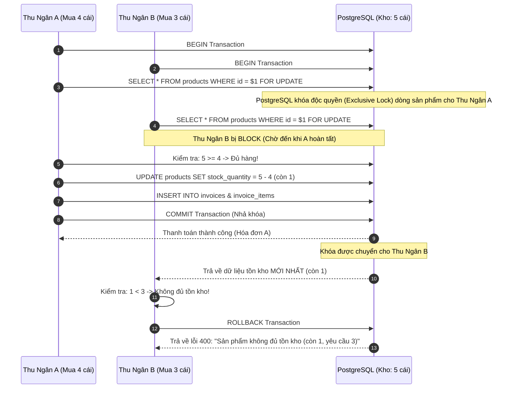

# 05. Kiểm Soát Tương Tranh POS, Chống Bán Âm Kho & Idempotency (Concurrency & POS Engine)

Một trong những bài toán phức tạp nhất của hệ thống siêu thị / cửa hàng tạp hóa có nhiều thu ngân là **kiểm soát tương tranh (Concurrency Control)** khi nhiều nhân viên cùng bán các mặt hàng cuối cùng trong kho tại cùng một thời điểm.

---

## 1. Vấn Đề Bán Vượt Kho (Overselling / Race Condition)

Giả sử sản phẩm **Mì Hảo Hảo** chỉ còn đúng **5 gói** trong kho:
- **Thu ngân A** bấm thanh toán cho khách: Mua **4 gói**.
- **Thu ngân B** (tại máy khác) bấm thanh toán cùng lúc: Mua **3 gói**.

### Nếu không có kiểm soát tương tranh:
1. Cả hai luồng cùng đọc số lượng tồn kho là `5`.
2. Thu ngân A kiểm tra: `5 >= 4` -> Đủ hàng -> Bán -> Cập nhật tồn kho còn `1`.
3. Thu ngân B kiểm tra: `5 >= 3` -> Đủ hàng -> Bán -> Cập nhật tồn kho còn `-2`!
👉 **Hậu quả**: Cửa hàng bị bán khống hàng không có thực, tồn kho âm, thất thoát tài chính.

---

## 2. Giải Pháp Kiểm Soát Tương Tranh: Khóa Dòng Bi Quan (`SELECT ... FOR UPDATE`)

Hệ thống giải quyết triệt để vấn đề này tại tầng cơ sở dữ liệu thông qua cơ chế khóa dòng bi quan (**Pessimistic Row Locking**):



---

## 3. Thuật Toán Triệt Tiêu Deadlock (Chống Bế Tắc Hàng Loạt)

Khi khách hàng mua nhiều sản phẩm cùng lúc (ví dụ giỏ hàng có Sản phẩm X và Sản phẩm Y):
- Giao dịch A muốn khóa X rồi khóa Y.
- Giao dịch B muốn khóa Y rồi khóa X.
- Cả hai sẽ chờ nhau mãi mãi (**Deadlock**).

### Cơ chế triệt tiêu Deadlock trong `services/posService.js`:
Trước khi thực hiện khóa dòng, danh sách sản phẩm trong giỏ hàng luôn được **sắp xếp theo thứ tự mã ID tăng dần**:

```javascript
// Sắp xếp ID theo thứ tự xác định (Deterministic Order)
const sortedItems = [...cartItems].sort((a, b) => a.productId.localeCompare(b.productId));

for (const item of sortedItems) {
  // Thực hiện khóa tuần tự từ nhỏ đến lớn
  const product = await client.query(
    'SELECT id, name, stock_quantity, selling_price FROM products WHERE id = $1 FOR UPDATE',
    [item.productId]
  );
  // ...
}
```
> **Nguyên lý Dijkstra**: Khi tất cả các giao dịch trong hệ thống đều yêu cầu khóa tài nguyên theo cùng một thứ tự nghiêm ngặt, đồ thị chu trình chờ (Wait-For Graph) không bao giờ xuất hiện vòng lặp, triệt tiêu 100% nguy cơ Deadlock.

---

## 4. Cơ Chế Chống Trùng Hóa Đơn (Idempotency Pattern)

Khi mạng di động của thu ngân bị chập chờn hoặc thu ngân bấm nút "Thanh toán" hai lần liên tiếp:

1. Frontend tự sinh một khóa duy nhất dạng UUIDv4: `Idempotency-Key: c9b2512f-6c17-47bf-8f5c-8dfa12b489c1`.
2. Backend kiểm tra xem khóa này đã tồn tại trong bảng `invoices` chưa:
   - **Nếu chưa có**: Tiến hành tạo hóa đơn, trừ kho bình thường.
   - **Nếu đã có**: Lập tức trả về nguyên vẹn dữ liệu hóa đơn đã tạo trước đó với cờ `isDuplicate = true`, **tuyệt đối không trừ kho lần hai, không tạo hóa đơn trùng**.
3. Ràng buộc `UNIQUE (idempotency_key)` tại cấp độ bảng đảm bảo tính đúng đắn ngay cả khi hai request gửi đến song song cùng một mili giây.

---

## 5. Đồng Bộ Thời Gian Thực Qua WebSockets (`services/socketService.js`)

Khi một giao dịch POS hoàn tất thành công:
```javascript
// Phát sự kiện cập nhật tồn kho tới tất cả client đang mở ứng dụng
io.emit('stock:updated', {
  productId: item.productId,
  newStock: newQuantity,
  updatedAt: new Date().toISOString()
});

// Phát sự kiện hóa đơn mới cho màn hình tổng quan quản lý
io.emit('invoice:created', {
  invoiceId: newInvoice.id,
  code: newInvoice.invoice_code,
  total: newInvoice.final_amount
});
```
Mọi điện thoại hoặc máy tính bảng của các nhân viên khác trong cửa hàng sẽ tự động cập nhật số lượng tồn kho trên màn hình giỏ hàng mà không cần bấm F5.
