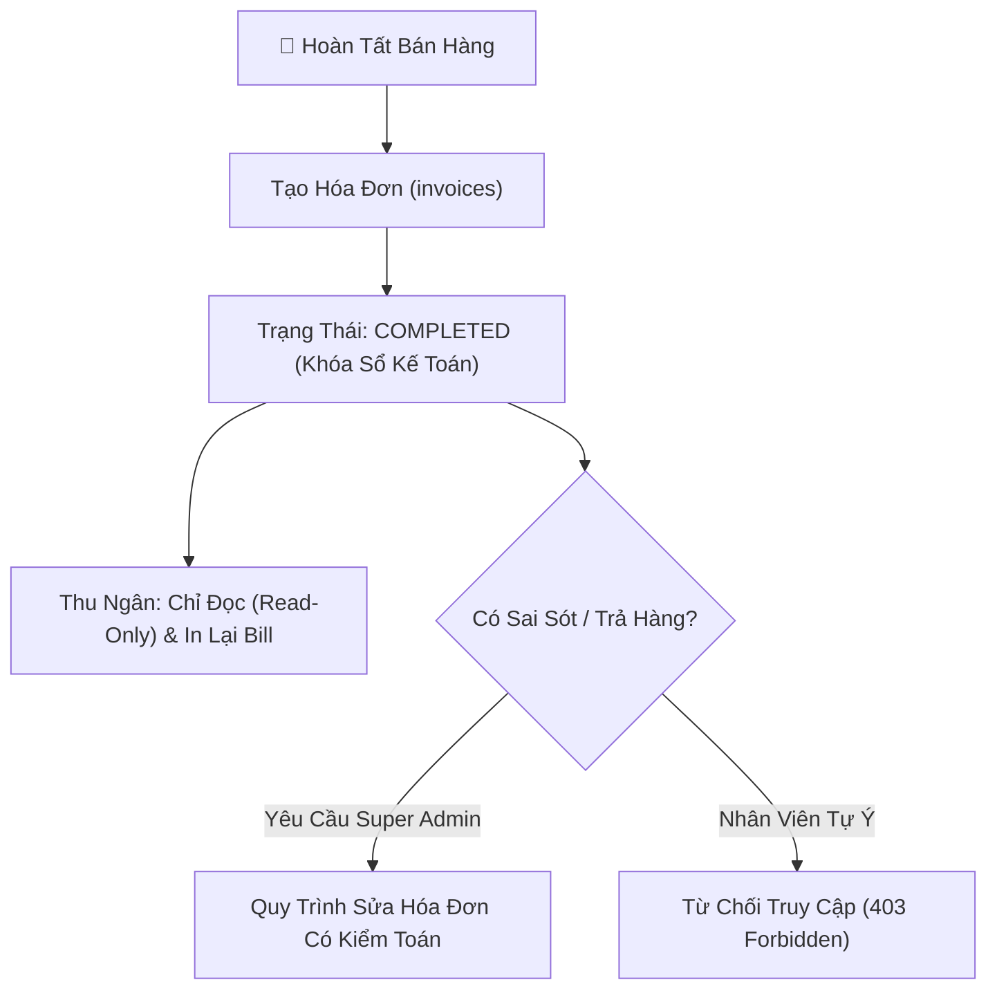

# 06. Quản Lý Hóa Đơn Bất Biến & Điều Chỉnh Tài Chính (Invoices & Financial Adjustments)

Module Hóa đơn phụ trách lưu trữ, tra cứu và kiểm soát chứng từ bán hàng, đảm bảo tính bất biến của sổ sách kế toán đồng thời hỗ trợ quy trình xử lý ngoại lệ an toàn.

---

## 1. Tính Bất Biến Của Hóa Đơn (Invoice Immutability)

Theo nguyên tắc kế toán chuẩn:
- Một khi hóa đơn đã được thanh toán và in ra cho khách hàng, **dữ liệu hóa đơn là bất biến (Immutable)**.
- Thu ngân thông thường (`STAFF` hoặc `ADMIN`) **không có quyền xóa hoặc tự ý sửa đổi hóa đơn** sau khi đã hoàn tất.
- Bảng `invoices` và `invoice_items` lưu trữ giá bán tại thời điểm giao dịch (`unit_price`), độc lập với việc sau này sản phẩm có tăng giá hay giảm giá.

---

## 2. Cấu Trúc Dữ Liệu Hóa Đơn & Chi Tiết Hóa Đơn

### Bảng `invoices` (Phần đầu hóa đơn)
- `invoice_code`: Mã hóa đơn duy nhất có thể đọc được (ví dụ: `HD-20260920-0042`).
- `cashier_id`: Khóa ngoại trỏ đến nhân viên thu ngân lập phiếu.
- `subtotal`: Tổng tiền hàng trước chiết khấu.
- `discount_amount`: Số tiền giảm giá khuyến mãi (nếu có).
- `tax_amount`: Thuế GTGT (VAT nếu áp dụng).
- `final_amount`: Tổng tiền khách phải trả thực tế (`subtotal - discount_amount + tax_amount`).
- `payment_method`: Phương thức (`CASH` - Tiền mặt, `TRANSFER` - Chuyển khoản ngân hàng).
- `status`: Trạng thái (`COMPLETED`, `ADJUSTED`, `CANCELLED`).
- `idempotency_key`: Khóa chống trùng giao dịch.

### Bảng `invoice_items` (Danh sách món hàng)
- `product_id`: Khóa ngoại trỏ đến bảng sản phẩm.
- `product_name`: Tên sản phẩm được sao chép nguyên trạng tại thời điểm bán (Snapshot name).
- `quantity`: Số lượng mua (ràng buộc `CHECK quantity > 0`).
- `unit_price`: Đơn giá bán tại thời điểm in hóa đơn.
- `total_price`: Thành tiền (`quantity * unit_price`).

---

## 3. Quy Trình Điều Chỉnh Hóa Đơn Có Kiểm Toán (`services/invoiceService.js`)

Khi phát sinh tình huống khách trả hàng, nhân viên tính nhầm số lượng, hoặc nhập sai món:

### Điều kiện thực hiện:
1. **Quyền hạn duy nhất**: Chỉ người dùng có vai trò `SUPER_ADMIN` mới có quyền gọi API điều chỉnh hóa đơn (`PUT /api/invoices/:id/adjust`).
2. **Lý do bắt buộc**: Phải nhập trường `reason` (tối thiểu 10 ký tự giải trình rõ lý do điều chỉnh).
3. **Cân đối kho tự động**:
   - Nếu điều chỉnh giảm số lượng món hàng: Số lượng chênh lệch sẽ được tự động cộng trả lại vào kho (`inventory_transactions` với type `RETURN`).
   - Nếu điều chỉnh tăng số lượng: Kiểm tra tồn kho và trừ thêm kho tương ứng.
4. **Ghi vết kiểm toán (Audit Logging)**:
   - Hệ thống tự động ghi nhận bản ghi kiểm toán với trạng thái cũ (`old_values`) và trạng thái mới (`new_values`) bao gồm cả chênh lệch tiền mặt để phục vụ đối chiếu quỹ tiền quầy cuối ngày.

---

## 4. Định Dạng In Hóa Đơn Nhiệt (Thermal Receipt 58mm / 80mm)

Giao diện Frontend cung cấp mẫu in hóa đơn nhiệt tiêu chuẩn ([ReceiptModal.jsx](file:///c:/grocery_store/frontend/src/components/pos/ReceiptModal.jsx)):
- Tiêu đề tên cửa hàng, địa chỉ, số điện thoại.
- Mã hóa đơn, ngày giờ lập phiếu chuẩn `Asia/Ho_Chi_Minh`.
- Bảng danh sách mặt hàng: Tên, Số lượng, Đơn giá, Thành tiền.
- Tổng tiền, số tiền khách đưa, tiền thối lại cho khách.
- Lời cảm ơn và mã QR tra cứu hoặc chuyển khoản thanh toán.
- Tự động kích hoạt hộp thoại in `window.print()` với CSS Media `@media print` được tối ưu hóa độ tương phản cao, tự động căn giữa và ngắt trang sạch sẽ.
