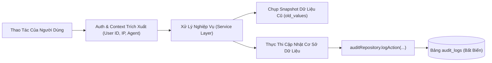

# 07. Hệ Thống Nhật Ký Kiểm Toán Toàn Diện (Audit Logging System)

Trong môi trường có nhiều quản trị viên và nhân viên cùng làm việc, tính minh bạch và khả năng truy vết trách nhiệm là yếu tố sống còn để ngăn ngừa thất thoát hàng hóa và gian lận tài chính.

---

## 1. Nguyên Tắc Thiết Kế Bất Biến (Append-Only Audit Trail)

Bảng `audit_logs` được thiết kế theo nguyên tắc **chỉ ghi thêm (Append-Only)**:
- Không cung cấp bất kỳ API hoặc câu lệnh nào để sửa đổi (`UPDATE`) hoặc xóa (`DELETE`) dữ liệu kiểm toán.
- Dữ liệu trước và sau biến động được lưu trữ dưới dạng **PostgreSQL JSONB**, cho phép truy vấn linh hoạt từng trường dữ liệu thay đổi.

---

## 2. Cấu Trúc Bảng Dữ Liệu Kiểm Toán (`audit_logs`)

| Tên Cột | Kiểu Dữ Liệu | Ý Nghĩa & Mục Đích |
|:---|:---|:---|
| `id` | UUID | Khóa chính ngẫu nhiên |
| `user_id` | UUID | Khóa ngoại trỏ đến tài khoản thực hiện hành động |
| `action` | VARCHAR(50) | Mã định danh hành vi (ví dụ: `CREATE_INVOICE`, `ADJUST_STOCK`) |
| `entity_type` | VARCHAR(50) | Thực thể bị tác động (`INVOICE`, `PRODUCT`, `INVENTORY`, `USER`) |
| `entity_id` | VARCHAR(100) | Khóa chính của thực thể bị tác động |
| `old_values` | JSONB | Trạng thái dữ liệu TRƯỚC khi thay đổi (Before state) |
| `new_values` | JSONB | Trạng thái dữ liệu SAU khi thay đổi (After state) |
| `ip_address` | VARCHAR(45) | Địa chỉ IP của máy gửi request (hỗ trợ cả IPv4 & IPv6) |
| `user_agent` | TEXT | Thông tin thiết bị và trình duyệt gửi request |
| `created_at` | TIMESTAMPTZ | Thời gian chính xác theo chuẩn múi giờ Việt Nam (`+07:00`) |

---

## 3. Danh Mục Các Hành Vi Bắt Buộc Ghi Kiểm Toán

1. **Nhóm Xác thực (Authentication)**:
   - `LOGIN`: Ghi nhận thời gian, IP và thiết bị đăng nhập thành công.
   - `LOGIN_FAILED`: Lưu vết nỗ lực xâm nhập không hợp lệ.
2. **Nhóm Bán hàng (POS & Invoices)**:
   - `CREATE_INVOICE`: Lưu mã hóa đơn, thu ngân, tổng tiền và phương thức thanh toán.
   - `ADJUST_INVOICE`: Lưu lý do, chi tiết món sửa đổi và chênh lệch tiền.
3. **Nhóm Kho hàng (Inventory)**:
   - `IMPORT_STOCK`: Lưu số lượng nhập, giá vốn mới và số tồn sau nhập.
   - `ADJUST_STOCK`: Lưu lý do chênh lệch kho, số lượng tăng/giảm và số tồn thực tế.
4. **Nhóm Sản phẩm (Catalog)**:
   - `CREATE_PRODUCT`: Lưu thông số ban đầu của sản phẩm.
   - `UPDATE_PRODUCT`: Lưu chi tiết trường bị sửa (ví dụ: giá bán đổi từ 15k lên 18k).
   - `DELETE_PRODUCT`: Lưu hành vi ngưng kinh doanh sản phẩm.
5. **Nhóm Quản trị tài khoản (Users)**:
   - `CREATE_USER`, `UPDATE_USER`, `TOGGLE_USER_ACTIVE`.

---

## 4. Giao Diện So Sánh Dữ Liệu (Audit Logs Explorer)

Trang [AuditLogsPage.jsx](file:///c:/grocery_store/frontend/src/pages/AuditLogsPage.jsx) (dành riêng cho `SUPER_ADMIN`):
- **Bộ lọc mạnh mẽ**: Tìm kiếm theo khoảng ngày, lọc theo loại hành động (`action`), loại thực thể (`entity_type`) hoặc nhân viên thực hiện.
- **Xem chi tiết Diff View**: Nhấn vào từng dòng lịch sử để mở Modal hiển thị dạng bảng so sánh 2 cột:
  - Cột đỏ: Dữ liệu cũ (`old_values`).
  - Cột xanh: Dữ liệu mới (`new_values`).
- Giúp chủ cửa hàng kiểm tra ngay lập tức ai đã thay đổi giá sản phẩm hoặc ai đã điều chỉnh tồn kho trong đêm.
