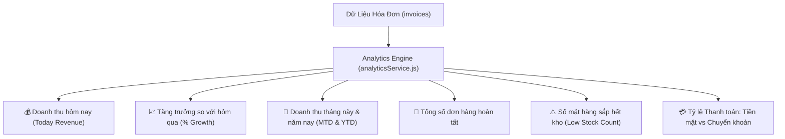

# 08. Báo Cáo Phân Tích Doanh Thu & Bảng Điều Khiển (Sales Analytics & KPIs)

Module Phân tích kinh doanh chịu trách nhiệm xử lý các truy vấn tổng hợp dữ liệu thời gian thực, cung cấp góc nhìn toàn diện cho chủ cửa hàng và quản lý.

---

## 1. Các Chỉ Số Hiệu Suất Cốt Lõi (Executive Dashboard KPIs)

Hệ thống tính toán tức thì các chỉ số tài chính thông qua `services/analyticsService.js`:



### Công thức tính tỷ lệ tăng trưởng so với ngày hôm trước:
```javascript
let growthRate = 0;
if (yesterdayRevenue > 0) {
  growthRate = ((todayRevenue - yesterdayRevenue) / yesterdayRevenue) * 100;
} else if (todayRevenue > 0) {
  growthRate = 100; // Tăng trưởng 100% nếu hôm trước không có doanh thu
}
```

---

## 2. Phân Tích Doanh Thu Theo Giờ Trong Ngày (Hourly Heatmap)

Để giúp chủ cửa hàng bố trí nhân sự và thời gian nhập hàng hợp lý:
- Hệ thống tổng hợp doanh số và số lượng đơn hàng theo 24 khung giờ trong ngày (từ `00:00` đến `23:00`).
- Sử dụng hàm SQL trích xuất giờ địa phương:
  ```sql
  SELECT 
    EXTRACT(HOUR FROM created_at AT TIME ZONE 'Asia/Ho_Chi_Minh') AS hour,
    COUNT(id) AS total_orders,
    SUM(final_amount) AS total_revenue
  FROM invoices
  WHERE created_at >= $1 AND created_at < $2 AND status = 'COMPLETED'
  GROUP BY hour
  ORDER BY hour ASC;
  ```
- **Lợi ích**: Dễ dàng nhận diện các khung giờ cao điểm (ví dụ: 11h30 - 13h00 trưa và 17h30 - 19h30 tối).

---

## 3. Các Khoảng Thời Gian Phân Tích Hỗ Trợ

Giao diện Báo cáo ([AnalyticsPage.jsx](file:///c:/grocery_store/frontend/src/pages/AnalyticsPage.jsx)) hỗ trợ chuyển đổi linh hoạt:
1. **Hôm nay (`today`)**: Chi tiết từng giờ và so sánh với hôm qua.
2. **7 ngày qua (`7days`)**: Nhìn rõ xu hướng mua sắm cuối tuần.
3. **30 ngày qua (`30days`)**: Xu hướng chu kỳ thanh toán lương và tiêu dùng.
4. **Tháng này (`month`)**: Diễn biến doanh thu từ ngày 1 đến ngày hiện tại.
5. **Năm nay (`year`)**: Tổng hợp doanh số 12 tháng, phục vụ tổng kết tài chính cuối năm.

---

## 4. Bảng Xếp Hạng Mặt Hàng Bán Chạy (Top-Selling Products)

Truy vấn bảng `invoice_items` gom nhóm theo `product_id`:
- Xác định top 10 sản phẩm có số lượng bán cao nhất và mang lại doanh thu lớn nhất.
- Giúp người quản lý chủ động đàm phán chiết khấu số lượng lớn với nhà cung cấp.

---

## 5. Tối Ưu Hóa Tốc Độ Truy Vấn (Performance)
- Tất cả các truy vấn doanh thu đều tận dụng chỉ mục B-Tree `idx_invoices_created_at`.
- Câu truy vấn chỉ lọc hóa đơn có trạng thái `status = 'COMPLETED'` để loại bỏ các đơn đã hủy hoặc điều chỉnh hoàn tiền.
- Thời gian phản hồi trung bình của API Dashboard: **< 40ms**.
