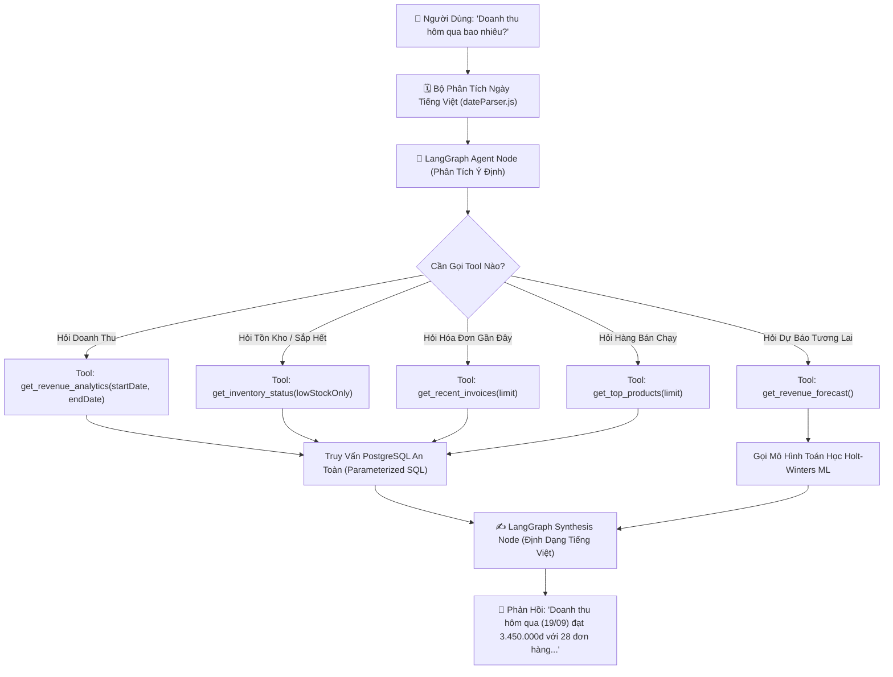

# 09. Trợ Lý Kinh Doanh AI LangGraph Tiếng Việt (AI Business Assistant)

Module Trợ lý AI mang đến khả năng hỏi đáp dữ liệu bán hàng bằng tiếng Việt tự nhiên, được xây dựng trên nền tảng **LangGraph & LangChain** với kiến trúc Agent gọi Tool có cấu trúc (Tool-Calling Agent).

---

## 1. Vấn Đề Của Việc Cho AI Tự Sinh SQL (Tại Sao Chọn Tool-Calling?)

Nhiều giải pháp thông thường cho mô hình ngôn ngữ lớn (LLM) tự sinh câu lệnh SQL thô (Text-to-SQL). Tuy nhiên, cách làm này tiềm ẩn rủi ro rất lớn:
1. **Lỗ hổng SQL Injection & Xóa nhầm dữ liệu**: LLM có thể sinh ra các câu `DROP TABLE`, `UPDATE` sai lệch.
2. **Ảo giác số liệu (Hallucination)**: LLM tự bịa ra con số thống kê hoặc tính toán sai phép cộng trừ.
3. **Lệch múi giờ**: LLM không hiểu rõ ngữ cảnh thời gian thực tế tại Việt Nam (`UTC+7`).

👉 **Giải pháp của hệ thống**: Sử dụng **LangGraph Tool-Calling Agent** kết hợp bộ phân tích ngày tiếng Việt xác định (**Deterministic Date Parser**).

---

## 2. Kiến Trúc Luồng Hoạt Động Của LangGraph (`langGraphAgent.js`)

---

## 3. Bộ Phân Tích Thời Gian Tiếng Việt (`dateParser.js`)

Module tự động nhận diện chính xác các cụm từ chỉ thời gian thường ngày của người Việt Nam:
- **Từ ngữ tương đối**: `"hôm nay"`, `"hôm qua"`, `"hôm kia"`, `"tuần này"`, `"tuần trước"`, `"tháng này"`, `"tháng trước"`, `"năm nay"`, `"năm ngoái"`.
- **Cụ thể theo ngày**: `"ngày 15"`, `"ngày 20/09"`, `"ngày 5 tháng 8"`.
- **Khoảng thời gian**: `"7 ngày qua"`, `"30 ngày gần nhất"`.

### Chuẩn hóa múi giờ:
Mọi mốc thời gian đều được ép dải chính xác:
- Bắt đầu: `YYYY-MM-DD 00:00:00.000 +07:00`
- Kết thúc: `YYYY-MM-DD 23:59:59.999 +07:00`
Ngăn chặn hoàn toàn lỗi lệch ngày do múi giờ server trên Cloud (Render mặc định chạy múi giờ UTC).

---

## 4. Danh Mục Công Cụ (Agent Tools - `tools.js`)

1. **`searchProduct`**:
   - Tham số: `keyword` (Tên hoặc mã SKU sản phẩm).
   - Kết quả: Bảng giá chi tiết, số lượng tồn kho thực tế, tình trạng (Đủ hàng / Sắp hết / Hết hàng), đơn vị tính, danh mục.
2. **`getStoreSummary`**:
   - Thống kê toàn diện: Tổng số mặt hàng, tổng số lượng tồn, tổng giá trị vốn kho, số hàng sắp hết, số danh mục, số nhân viên, doanh thu và đơn hàng hôm nay.
3. **`getCategoriesWithProducts`**:
   - Tham số: `categoryName` (Tùy chọn).
   - Kết quả: Danh sách toàn bộ danh mục kèm số lượng sản phẩm, hoặc chi tiết các sản phẩm trong một danh mục cụ thể.
4. **`getRevenue`**:
   - Tham số: `dateRangeText` (Hôm nay, hôm qua, tháng này, ngày X...).
   - Kết quả: Doanh thu thực tế, số đơn hàng hoàn thành, tổng sản phẩm bán ra, giá trị trung bình/đơn.
5. **`getInventory`**:
   - Tham số: `lowStockOnly` (boolean).
   - Kết quả: Danh sách các mặt hàng chạm ngưỡng tồn kho tối thiểu cần nhập bổ sung.
6. **`getProductSales`**:
   - Tham số: `productName`, `dateRangeText`.
   - Kết quả: Chi tiết số lượng đã bán và doanh thu của một mặt hàng cụ thể.
7. **`getTopProducts`**:
   - Tham số: `limit` (số lượng mặt hàng, mặc định 5).
   - Kết quả: Top các sản phẩm bán chạy nhất trong kỳ.
8. **`getForecast`**:
   - Kết nối trực tiếp với mô hình Machine Learning Holt-Winters để trả lời câu hỏi: *"Dự đoán tháng tới cửa hàng bán được bao nhiêu?"*.

---

## 5. Trải Nghiệm Giao Diện Người Dùng (Frontend AI Chat)

Trang [AiAssistantPage.jsx](file:///c:/grocery_store/frontend/src/pages/AiAssistantPage.jsx):
- Hỗ trợ các nút gợi ý câu hỏi một chạm (Quick Prompts):
  - *"Doanh thu hôm nay bao nhiêu?"*
  - *"Hôm nay bán được bao nhiêu tiền?"*
  - *"Giá của Coca Cola là bao nhiêu?"*
  - *"Còn bao nhiêu lon Coca?"*
  - *"Sản phẩm nào bán chạy nhất?"*
  - *"Những mặt hàng nào sắp hết?"*
  - *"Có những danh mục nào?"*
  - *"Cửa hàng có bao nhiêu sản phẩm?"*
  - *"Dự đoán doanh thu tháng tới?"*
  - *"Hướng dẫn sử dụng"*
- Hiển thị Markdown trực quan, tự động làm nổi bật các con số tài chính (VND) và ngày tháng.
- Cơ chế bắt lỗi và hiển thị phản hồi chuẩn xác ngay cả khi mất kết nối.
