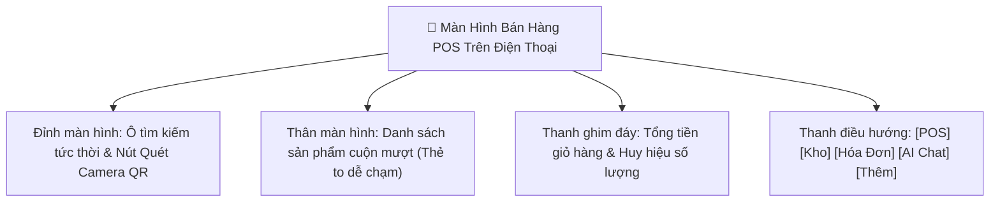

# 11. Ứng Dụng Frontend React SPA & Trải Nghiệm Mobile-First (Frontend Architecture)

Frontend được phát triển theo triết lý **Mobile-First**, tối ưu hóa hoàn hảo cho thao tác một tay bằng ngón tay cái trên điện thoại thông minh, đồng thời hiển thị trực quan, chuyên nghiệp trên máy tính bảng và màn hình máy tính POS.

---

## 1. Cấu Trúc Thư Mục & Phân Tầng Ứng Dụng

```text
frontend/src/
├── assets/             # Hình ảnh logo, hero banner, icon SVG
├── components/         # Các thành phần tái sử dụng
│   ├── common/         # Navbar, Sidebar, MobileBottomNav, Modal, ConfirmDialog
│   └── pos/            # CartDrawer, QrScannerModal, ReceiptModal
├── contexts/           # Quản lý trạng thái toàn cục (Context API)
│   ├── AuthContext.jsx # Quản lý phiên đăng nhập, JWT & phân quyền
│   ├── CartContext.jsx # Giỏ hàng POS, số lượng, giảm giá & tính tiền thối
│   └── SocketContext.jsx # Kết nối Socket.IO thời gian thực & cảnh báo âm thanh
├── pages/              # Các màn hình chức năng chính
│   ├── PosPage.jsx          # Bán hàng POS, quét QR, tìm kiếm món
│   ├── DashboardPage.jsx    # Bảng điều khiển, KPI & thẻ dự báo AI
│   ├── ProductsPage.jsx     # Quản lý danh mục sản phẩm, in tem QR
│   ├── CategoriesPage.jsx   # Quản lý danh mục hàng hóa
│   ├── InventoryPage.jsx    # Nhập kho, kiểm kê điều chỉnh kho
│   ├── InvoicesPage.jsx     # Lịch sử hóa đơn, in lại bill, sửa hóa đơn
│   ├── AnalyticsPage.jsx    # Báo cáo doanh số 24h, 7 ngày, 30 ngày
│   ├── AiAssistantPage.jsx  # Chatbox trợ lý kinh doanh AI
│   ├── AuditLogsPage.jsx    # Nhật ký kiểm toán Before/After
│   ├── AdminsPage.jsx       # Quản trị tài khoản & phân quyền
│   └── LoginPage.jsx        # Đăng nhập bảo mật
├── services/           # Lớp kết nối HTTP API (Axios client)
└── utils/              # Định dạng tiền tệ VND, thời gian tiếng Việt
```

---

## 2. Thiết Kế Trải Nghiệm Người Dùng (Mobile Ergonomics)



### Các điểm nhấn Ergonomics:
1. **Nút chạm ngón tay cái**: Các nút bấm `[-]`, `[+]`, nút quét QR và nút "Thanh toán" đều có kích thước tối thiểu `48x48px`, khoảng cách rộng rãi, chống bấm nhầm khi bán hàng vội.
2. **Thanh giỏ hàng trượt từ đáy (Sliding Bottom Drawer)**: Giỏ hàng được ẩn gọn dưới đáy màn hình, chỉ chiếm 1 thanh ghim mỏng hiển thị số món và tổng tiền. Khi chạm vào, giỏ hàng trượt lên chiếm toàn màn hình để kiểm tra và thu tiền.
3. **Tính tiền thối tự động**: Thu ngân chỉ cần chọn các mệnh giá tiền mặt phổ biến (50k, 100k, 200k, 500k) hoặc nhập số tiền khách đưa, hệ thống tự động tính ra tiền thối cần trả lại cho khách tức thì.

---

## 3. Tích Hợp Camera Quét Mã Barcode & QR (`html5-qrcode`)

Tại file [QrScannerModal.jsx](file:///c:/grocery_store/frontend/src/components/pos/QrScannerModal.jsx):
- Sử dụng trực tiếp API `navigator.mediaDevices.getUserMedia` thông qua thư viện `html5-qrcode`.
- Tự động nhận diện camera sau (Back camera) của điện thoại.
- Khung ngắm quét laser động tạo cảm giác chuyên nghiệp và chính xác.
- Khi nhận diện mã thành công: Tự động rung điện thoại (`navigator.vibrate`), phát tiếng *beep* nhẹ và đóng modal trong 0.2s để tiếp tục bán hàng.

---

## 4. Quản Lý Trạng Thái Realtime (`SocketContext.jsx`)

Khi kết nối tới Backend qua WebSocket:
- Tự động bắt sự kiện `stock:updated`: Cập nhật lại số lượng tồn kho của sản phẩm đang hiển thị trên màn hình POS.
- Nếu sản phẩm bị giảm về 0 (hết hàng): Nút thêm vào giỏ hàng tự động chuyển sang màu xám và vô hiệu hóa (`Disabled`).
- Giúp quầy thu ngân A không thể tiếp tục bán món hàng mà quầy thu ngân B vừa thanh toán hết.

---

## 5. Mẫu In Hóa Đơn Chuẩn Khổ Nhiệt (`ReceiptModal.jsx`)

- Thiết kế sử dụng CSS chuyên dụng cho in ấn:
  ```css
  @media print {
    body * { visibility: hidden; }
    #printable-receipt, #printable-receipt * { visibility: visible; }
    #printable-receipt {
      position: absolute;
      left: 0;
      top: 0;
      width: 100%;
    }
  }
  ```
- Tương thích tốt với mọi máy in nhiệt cầm tay Bluetooth, máy in USB khổ 58mm hoặc 80mm.
