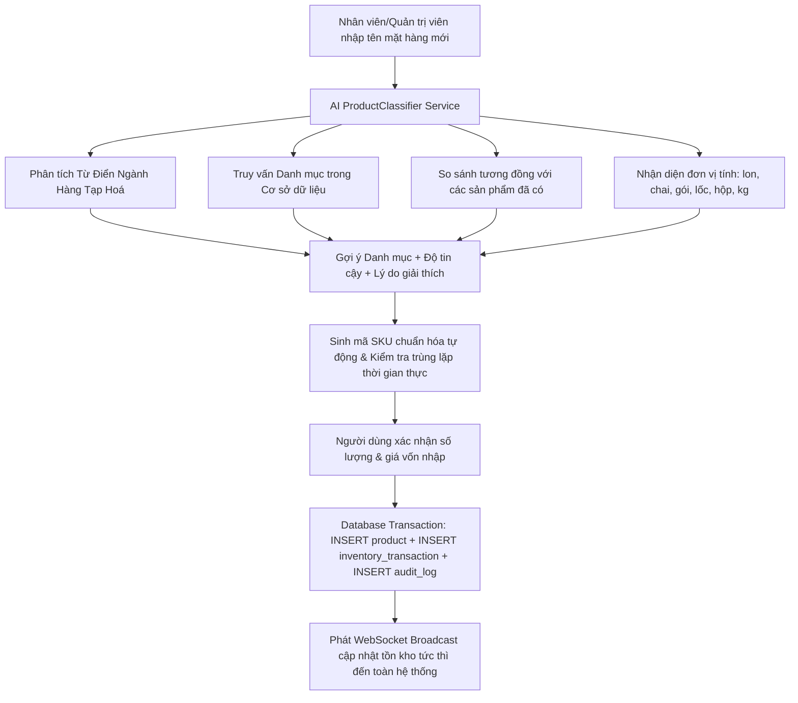

# 15. Phân Loại Sản Phẩm Tự Động Bằng AI & Nhập Hàng Thông Minh

## 1. Tổng Quan
Hệ thống Grocery Store cung cấp tính năng **Nhập hàng thông minh kết hợp Phân loại sản phẩm tự động bằng AI** (`AI Product Classifier & Smart Stock Import`). Tính năng này giải quyết triệt để vấn đề tốn thời gian khi nhập mặt hàng mới vào kho, sai lệch phân loại danh mục hàng hoá và nhập liệu thủ công đơn vị tính / mã SKU.

---

## 2. Kiến Trúc & Luồng Xử Lý (Workflow)



---

## 3. Các Thành Phần Kỹ Thuật

### 3.1. Engine Phân Loại AI (`ProductClassifier`)
- **Tập tin**: `backend/src/modules/ai/classifier/productClassifier.js`
- **Cơ chế**:
  1. Chuẩn hóa tên sản phẩm tiếng Việt (bỏ dấu, chuyển chữ thường, tách từ khóa).
  2. Tra cứu cơ sở tri thức ngành hàng tạp hóa (Nước giải khát, Mì & Bún khô, Bánh kẹo & Snack, Sữa & Chế phẩm, Gia vị & Dầu ăn, Đồ uống tươi pha chế).
  3. Quét danh mục thực tế đang hoạt động trong PostgreSQL.
  4. Tính điểm tương quan ngữ nghĩa (Semantic Weighted Scoring) và độ tương đồng với kho hàng hiện tại.
  5. Trả về:
     - `categoryId`: ID danh mục phù hợp nhất.
     - `categoryName`: Tên danh mục hiển thị.
     - `confidence`: Điểm tin cậy (0.70 - 0.99).
     - `reason`: Giải thích chi tiết bằng tiếng Việt dễ hiểu.
     - `suggestedCode`: Mã sản phẩm SKU đề xuất viết hoa không dấu.
     - `suggestedUnit`: Đơn vị tính phát hiện được (`lon`, `chai`, `gói`, `lốc`, `hộp`, `cái`, `kg`).
     - `alternatives`: Danh sách các danh mục khả dĩ kèm điểm tin cậy.

### 3.2. API Endpoints

| Phương thức | Đường dẫn | Quyền | Chức năng |
|---|---|---|---|
| `POST` | `/api/ai/classify-product` | Authenticated | Phân tích tên sản phẩm và trả về danh mục, độ tin cậy, lý do, mã gợi ý |
| `POST` | `/api/inventory/import-new` | `ADMIN`, `SUPER_ADMIN` | Nhập kho mặt hàng hoàn toàn mới kèm phân loại AI, sinh SKU và tạo giao dịch |
| `GET` | `/api/products/check-code` | Authenticated | Kiểm tra mã sản phẩm xem đã tồn tại chưa |

#### Dữ liệu gửi lên `POST /api/inventory/import-new`:
```json
{
  "name": "Trà Ô Long Tea+ Plus 455ml",
  "productCode": "TRA-O-LONG-TEA-PLUS-455ML",
  "categoryId": "c0000000-0000-0000-0000-000000000001",
  "unit": "chai",
  "quantity": 50,
  "costPrice": 8500,
  "sellingPrice": 11000,
  "minimumStock": 5,
  "reason": "Nhập hàng mới đợt hè"
}
```

### 3.3. Đảm Bảo Toàn Vẹn Dữ Liệu Trong 1 Giao Dịch (`Transaction`)
Khi gọi `/api/inventory/import-new`:
1. Mở giao dịch `BEGIN;`.
2. Chèn bản ghi sản phẩm mới vào bảng `products` với số lượng tồn kho ban đầu = `quantity`.
3. Ghi nhận phiếu biến động kho `inventory_transactions` với `transaction_type = 'IMPORT'`, `quantity_before = 0`, `quantity_change = quantity`, `quantity_after = quantity`.
4. Ghi nhận nhật ký kiểm toán hệ thống `audit_logs` với `action = 'IMPORT_NEW_PRODUCT'`.
5. Thực hiện `COMMIT;`.
6. Bắn sự kiện WebSocket `broadcastStockUpdate` để màn hình POS và Báo cáo tự động cập nhật số liệu ngay lập tức.

---

## 4. Giao Diện Người Dùng (Frontend SPA)

### 4.1. Trang Kho Hàng (`InventoryPage.jsx`)
- **Nút "Nhập Hàng Mới AI"** trên thanh tiêu đề: Cho phép mở ngay modal ở chế độ AI.
- **Hộp thoại Nhập Kho 2 Chế Độ**:
  - *Chế độ 1 - Sản phẩm có sẵn*: Nhập bổ sung tồn kho cho hàng hóa hiện có.
  - *Chế độ 2 - Mặt hàng mới (AI Phân Loại)*:
    - Ô nhập tên hàng kèm nút **"✨ AI Phân Loại"** và cơ chế debounce tự động nhận diện sau khi gõ tên.
    - Huy hiệu AI hiển thị trực quan: Tên danh mục được chọn, tỷ lệ tin cậy và lý do phân loại.
    - Mã SKU tự sinh kèm đèn kiểm tra trùng lặp (Xanh lá: Hợp lệ; Đỏ: Đã tồn tại + Nút tự đổi đuôi `-01`, `-02`).
    - Gợi ý đơn vị tính thông minh theo đặc tính sản phẩm.
    - Tự động tính giá bán đề xuất dựa trên giá vốn (Vốn + 25%).

### 4.2. Trang Quản Lý Sản Phẩm (`ProductsPage.jsx`)
- Thêm nút **"✨ AI Phân Loại"** cạnh trường chọn "Danh mục".
- Khi bấm, AI tự động quét tên sản phẩm và chọn ngay danh mục phù hợp nhất, kèm thẻ hiển thị giải thích lý do cho người dùng.

---

## 5. Kiểm Thử Tự Động (Automated Testing)
Tính năng đã được kiểm thử toàn diện trong `backend/test_suite.js`:
- `[9] Testing AI Product Auto-Classification Engine...`: Kiểm tra độ chính xác phân loại đồ uống và mì gói, tính hợp lệ của mã SKU sinh ra (Pass 100%).
- `[10] Testing Import Goods with AI Auto-Classification...`: Kiểm tra tạo sản phẩm mới, kiểm tra tồn kho khởi tạo, kiểm tra giao dịch `IMPORT` và nhật ký kiểm toán (Pass 100%).
