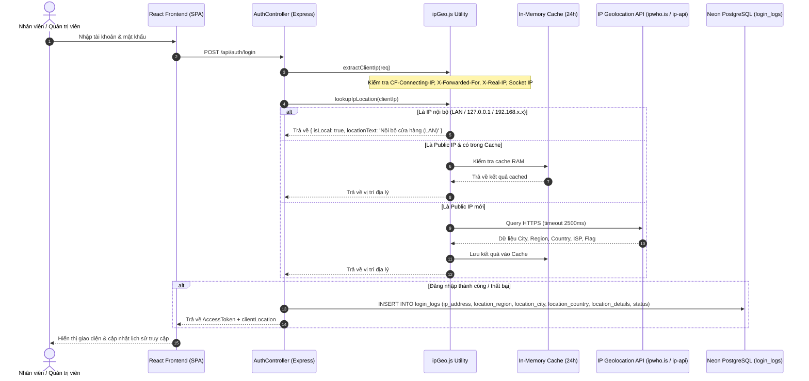

# TÀI LIỆU CHỨC NĂNG: ĐĂNG NHẬP VỚI ĐỊA CHỈ IP & ĐỊNH VỊ KHU VỰC (IP GEOLOCATION)

---

## 1. TỔNG QUAN & MỤC TIÊU
Trong hệ thống quản trị siêu thị tạp hóa POS & AI Engine, việc theo dõi bảo mật đăng nhập là yếu tố tối quan trọng. Chức năng **IP Geolocation** giúp hệ thống:
1. **Trích xuất chính xác địa chỉ IP thật của máy trạm đăng nhập** (vượt qua các lớp Reverse Proxy, Cloudflare CDN, Nginx, Vercel/Render Load Balancers).
2. **Xác định vị trí địa lý & khu vực của IP đó**: Thành phố (City), Tỉnh/Bang (Region), Quốc gia (Country), Nhà mạng/ISP cung cấp dịch vụ Internet.
3. **Phân biệt mạng nội bộ vs mạng ngoại vi**:
   - Các dải mạng LAN/Localhost (`127.0.0.1`, `::1`, `10.0.0.0/8`, `172.16.0.0/12`, `192.168.0.0/16`) được nhận diện tự động là **"Nội bộ cửa hàng (Localhost / LAN)"** mà không cần gọi API ra ngoài (độ trễ 0ms).
   - Các IP ngoại mạng (Public IP) được định vị thông qua dịch vụ Geolocation bảo mật, nhanh chóng với cơ chế cache in-memory TTL 24h và tự động chuyển vùng dự phòng (Failover).
4. **Lưu vết toàn bộ nỗ lực đăng nhập (thành công lẫn thất bại)** vào bảng `login_logs` trong Neon PostgreSQL và hiển thị trực quan trên giao diện Quản Trị Viên (`/admins` -> Tab "Lịch Sử Đăng Nhập").

---

## 2. LUỒNG KIẾN TRÚC & XỬ LÝ (ARCHITECTURE & DATA FLOW)



---

## 3. THAY ĐỔI CƠ SỞ DỮ LIỆU (DATABASE SCHEMA MIGRATION)

Bảng `login_logs` được bổ sung 4 cột mới để lưu trữ chi tiết địa lý:

```sql
-- Migration bổ sung các cột định vị cho nhật ký đăng nhập
ALTER TABLE login_logs ADD COLUMN IF NOT EXISTS location_region VARCHAR(100);
ALTER TABLE login_logs ADD COLUMN IF NOT EXISTS location_city VARCHAR(100);
ALTER TABLE login_logs ADD COLUMN IF NOT EXISTS location_country VARCHAR(50);
ALTER TABLE login_logs ADD COLUMN IF NOT EXISTS location_details JSONB;

-- Cấu trúc hoàn chỉnh của login_logs
CREATE TABLE IF NOT EXISTS login_logs (
    id UUID PRIMARY KEY DEFAULT gen_random_uuid(),
    user_id UUID REFERENCES users(id) ON DELETE SET NULL,
    username VARCHAR(50) NOT NULL,
    ip_address VARCHAR(45),
    user_agent TEXT,
    status VARCHAR(20) NOT NULL CHECK (status IN ('SUCCESS', 'FAILED')),
    failure_reason TEXT,
    location_region VARCHAR(100),
    location_city VARCHAR(100),
    location_country VARCHAR(50),
    location_details JSONB,
    created_at TIMESTAMPTZ NOT NULL DEFAULT NOW()
);
```

### Chi tiết ý nghĩa dữ liệu:
| Tên Cột | Kiểu Dữ Liệu | Ví Dụ | Ý Nghĩa |
| :--- | :--- | :--- | :--- |
| `ip_address` | `VARCHAR(45)` | `14.226.12.34` hoặc `127.0.0.1` | Địa chỉ IPv4 hoặc IPv6 thực tế của client |
| `location_region` | `VARCHAR(100)` | `Hanoi`, `Ho Chi Minh City`, `Khu vực nội bộ` | Tỉnh / Thành phố trực thuộc / Bang |
| `location_city` | `VARCHAR(100)` | `Hanoi`, `District 1`, `Cửa hàng (LAN)` | Quận / Huyện / Đô thị cụ thể |
| `location_country` | `VARCHAR(50)` | `Viet Nam`, `United States` | Quốc gia xuất xứ của luồng truy cập |
| `location_details` | `JSONB` | `{"isp": "VNPT", "timezone": "Asia/Bangkok", ...}` | Chi tiết kỹ thuật gồm ISP, tọa độ GPS, cờ quốc gia, múi giờ |

---

## 4. CHI TIẾT TRIỂN KHAI BACKEND

### 4.1. Module `backend/src/utils/ipGeo.js`
- **Hàm `extractClientIp(req)`**:
  - Ưu tiên: `cf-connecting-ip` (Cloudflare) -> `x-real-ip` (Nginx) -> `x-forwarded-for` (Lấy IP đầu tiên trong chuỗi phân tách bởi dấu phẩy) -> `req.ip` -> `socket.remoteAddress`.
  - Tự động bóc tách tiền tố IPv6-mapped IPv4 `::ffff:192.168.1.1` thành `192.168.1.1`.
  - Chuẩn hóa loopback `::1` về `127.0.0.1`.
- **Hàm `isPrivateOrLocalIp(ip)`**:
  - Sử dụng Regex kiểm tra các dải mạng RFC 1918 / RFC 4193: `127.0.0.1`, `10.0.0.0/8`, `172.16.0.0/12`, `192.168.0.0/16`, `169.254.0.0/16`, `fc00::/7`, `fe80::/10`.
- **Hàm `lookupIpLocation(ip)`**:
  - Bỏ qua API ngoài nếu là mạng nội bộ (Localhost / LAN POS).
  - Tra cứu Cache bộ nhớ RAM (`ipCache`, tối đa 1000 IP, hết hạn sau 24 giờ).
  - Provider chính: `https://ipwho.is/${ip}` (Hỗ trợ HTTPS, dữ liệu chính xác, không cần API key).
  - Provider dự phòng (Failover): `http://ip-api.com/json/${ip}`.
  - Sử dụng `AbortController` với thời gian chờ tối đa 2500ms, đảm bảo **không bao giờ làm chậm hoặc treo luồng đăng nhập** của nhân viên thu ngân.

### 4.2. Tích hợp `backend/src/controllers/authController.js`
- Khi người dùng gửi yêu cầu `POST /api/auth/login`:
  - Trích xuất IP ngay đầu request.
  - Tra cứu định vị bất đồng bộ.
  - Nếu đăng nhập thất bại (Sai mật khẩu, tài khoản không tồn tại, tài khoản bị tạm khóa): Ghi log trạng thái `FAILED` kèm IP và địa điểm vào `login_logs`.
  - Nếu đăng nhập thành công: Ghi log `SUCCESS` vào `login_logs`, đồng thời thêm `clientLocation` vào payload phản hồi và vết kiểm toán `audit_logs`.

### 4.3. Cập nhật `backend/src/repositories/userRepository.js`
- `recordLoginLog`: Tiếp nhận các tham số `locationRegion`, `locationCity`, `locationCountry`, `locationDetails` và lưu vào DB.
- `getLoginLogs`: Trả về toàn bộ trường dữ liệu của `login_logs` kèm họ tên đầy đủ của nhân viên.

---

## 5. GIAO DIỆN NGƯỜI DÙNG (FRONTEND REACT SPA)

Tại trang **Quản Trị Viên & Nhân Viên** (`frontend/src/pages/AdminsPage.jsx`):
- Tab **"Lịch Sử Đăng Nhập"** bổ sung cột **"Khu Vực / Vị Trí"** đặt cạnh cột "Địa Chỉ IP".
- Hiển thị trực quan:
  - Máy nội bộ tại cửa hàng: Badge `🏠 Nội bộ (Localhost / LAN)`.
  - Truy cập ngoại mạng: Icon `📍` đi kèm `[Thành phố], [Khu vực], [Quốc gia]` (VD: `Hanoi, Hanoi, Viet Nam`).
  - IP chưa định vị: Badge `🌐 Ngoại mạng`.
  - Cột Địa chỉ IP có icon `💻` với font monospace rõ ràng.

---

## 6. KIỂM THỬ TỰ ĐỘNG & BẢO ĐẢM CHẤT LƯỢNG

Hệ thống được tích hợp kiểm thử tự động trong `backend/test_suite.js` (Test case `[2B]`):
- **Kiểm thử 1**: Đăng nhập từ Localhost (`127.0.0.1`) -> Nhận diện chính xác máy trạm cục bộ (`isLocal: true`).
- **Kiểm thử 2**: Đăng nhập thông qua Proxy Forwarded Header (`X-Forwarded-For: 14.226.12.34, 10.0.0.1`) -> Trích xuất IP đầu `14.226.12.34` và định vị chính xác vị trí `Viet Nam` (`Hanoi`).
- **Kiểm thử 3**: Kiểm tra bảng `login_logs` qua API `/api/users/login-logs/history` -> Xác nhận các trường `location_city`, `location_country`, `location_region`, `location_details` được ghi nhận đầy đủ.

### Kết quả kiểm thử:
```
====================================================
 STARTING GROCERY STORE AUTOMATED TEST SUITE        
====================================================
[1] Testing Health Endpoint... -> PASS
[2] Testing Authentication & RBAC... -> PASS
[2B] Testing IP Extraction & Geolocation in Login Logs...
  ✅ PASS: Localhost login detects 127.0.0.1 with local subnet flag
  ✅ PASS: Login with forwarded IP extracts 14.226.12.34 and identifies Viet Nam
  ✅ PASS: Login logs history records IP geolocation columns (location_city, location_country)
...
====================================================
 TEST SUMMARY: 38 PASSED, 0 FAILED (100% SUCCESS)
====================================================
```
