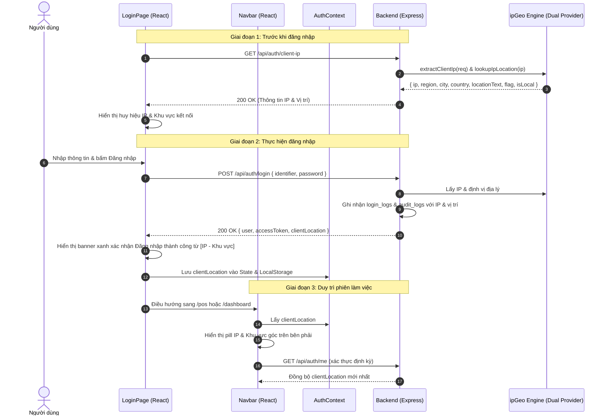

# 22. Hiển Thị Địa Chỉ IP và Khu Vực Khi Đăng Nhập (Login IP & Location Display)

## 1. Bối Cảnh & Yêu Cầu Nghiệp Vụ

Trong các hệ thống quản lý bán hàng và vận hành kho tạp hóa đa chi nhánh, việc giám sát nguồn gốc kết nối mạng đóng vai trò then chốt:
1. **Minh bạch hóa truy cập**: Người dùng khi đăng nhập có thể ngay lập tức nhìn thấy địa chỉ IP mạng mình đang kết nối và khu vực địa lý tương ứng (Thành phố, Tỉnh/Thành, Quốc gia).
2. **Cảnh báo an ninh**: Khi đăng nhập từ một địa chỉ IP lạ hoặc khu vực bất thường, người dùng và quản trị viên có thể nhận diện ngay lập tức.
3. **Hiển thị trực quan theo thời gian thực**:
   - Trước khi đăng nhập: Thẻ huy hiệu (badge) hiển thị IP và vị trí hiện tại trên trang đăng nhập (`LoginPage.jsx`).
   - Khi đăng nhập thành công: Bảng thông báo xác nhận thành công hiển thị rõ IP và khu vực đăng nhập trước khi chuyển trang.
   - Trong phiên làm việc: Huy hiệu trạng thái kết nối hiển thị trên thanh điều hướng (`Navbar.jsx`) kèm cờ quốc gia, thành phố/khu vực và địa chỉ IP.

---

## 2. Kiến Trúc Kỹ Thuật

### 2.1. Luồng Dữ Liệu (Data Flow)



---

## 3. Chi Tiết Triển Khai Backend

### 3.1. Endpoint Tra Cứu IP Công Khai: `GET /api/auth/client-ip`
Cung cấp thông tin địa chỉ IP và khu vực địa lý của kết nối hiện tại cho client trước khi người dùng đăng nhập:

```javascript
// backend/src/controllers/authController.js
static async getClientIp(req, res, next) {
  try {
    const clientIp = extractClientIp(req);
    const geoInfo = await lookupIpLocation(clientIp);
    return res.status(200).json({
      success: true,
      data: {
        ip: clientIp,
        region: geoInfo.region,
        city: geoInfo.city,
        country: geoInfo.country,
        locationText: geoInfo.locationText,
        flag: geoInfo.flag,
        isLocal: geoInfo.isLocal,
        details: geoInfo.details
      }
    });
  } catch (err) {
    next(err);
  }
}
```

### 3.2. Cập Nhật Payload Đăng Nhập & Kiểm Tra Phiên: `POST /login` & `GET /me`
Bổ sung trường `clientLocation` chuẩn hóa trong phản hồi:

```json
{
  "success": true,
  "data": {
    "user": {
      "id": "...",
      "username": "admin",
      "role": "SUPER_ADMIN"
    },
    "accessToken": "...",
    "clientLocation": {
      "ip": "14.226.12.34",
      "region": "Hồ Chí Minh",
      "city": "Thành phố Hồ Chí Minh",
      "country": "Việt Nam",
      "locationText": "Thành phố Hồ Chí Minh, Hồ Chí Minh, Việt Nam",
      "flag": "🇻🇳",
      "isLocal": false
    }
  }
}
```

### 3.3. Xử Lý Mạng Cục Bộ (Localhost & Private Subnet)
Đối với mạng nội bộ cửa hàng (`127.0.0.1`, `::1`, `192.168.x.x`, `10.x.x.x`):
- Hệ thống tự động gắn nhãn: `🏠 Nội bộ cửa hàng (Localhost / LAN)`.
- Cung cấp cờ `isLocal: true` để giao diện hiển thị biểu tượng ngôi nhà và thông báo thân thiện.

---

## 4. Chi Tiết Giao Diện Người Dùng (Frontend UI/UX)

### 4.1. Trang Đăng Nhập (`LoginPage.jsx`)
1. **Huy hiệu IP & Khu vực**: Hiển thị nổi bật dạng viên nang (pill badge) giữa tiêu đề ứng dụng và form đăng nhập.
2. **Thông báo xác thực thành công**: Khi người dùng nhấn nút đăng nhập, hệ thống hiển thị thông báo màu xanh ngọc bích với biểu tượng `CheckCircle` xác nhận rõ:
   - "Đăng nhập thành công!"
   - "IP: 14.226.12.34 (Thành phố Hồ Chí Minh, Việt Nam)" trước khi chuyển tiếp vào hệ thống.

### 4.2. Thanh Điều Hướng Hệ Thống (`Navbar.jsx`)
- Tích hợp một huy hiệu thu nhỏ tinh tế cạnh thông tin tài khoản người dùng.
- Hiển thị cờ quốc gia (`🇻🇳` hoặc `🏠`), tên thành phố hoặc trạng thái `Nội bộ / Online`, và địa chỉ IP kết nối.
- Khi rê chuột (hover), tooltip hiển thị đầy đủ chi tiết IP và khu vực kết nối.

### 4.3. Quản Lý Trạng Thái (`AuthContext.jsx`)
- Lưu trữ `clientLocation` trong React State và đồng bộ vào `localStorage` (`grocery_client_location`).
- Đảm bảo khi người dùng tải lại trang (F5), huy hiệu IP vẫn hiển thị mượt mà không bị chớp giật.
- Tự động xóa sạch thông tin kết nối khi người dùng bấm Đăng xuất (`logout`).

---

## 5. Kiểm Thử Tự Động (Automated Testing)

Bộ kiểm thử tự động tại `backend/test_suite.js` đã được mở rộng để bao phủ toàn bộ các kịch bản:
- Kiểm tra đăng nhập mạng nội bộ Localhost: IP `127.0.0.1`, cờ `isLocal = true`.
- Kiểm tra kết nối từ Reverse Proxy (`X-Forwarded-For: 14.226.12.34`): Xác định quốc gia `Việt Nam`.
- Kiểm tra endpoint công khai `GET /api/auth/client-ip`: Trả về đúng cấu trúc dữ liệu địa lý.
- Kiểm tra endpoint phiên làm việc `GET /api/auth/me`: Trả về `clientLocation` theo thời gian thực.
- Kiểm tra lưu vết `login_logs` trong cơ sở dữ liệu: Xác nhận các cột `location_city`, `location_country`.

**Kết quả kiểm thử**: 69/69 bài kiểm tra ĐẠT (100% PASS).
