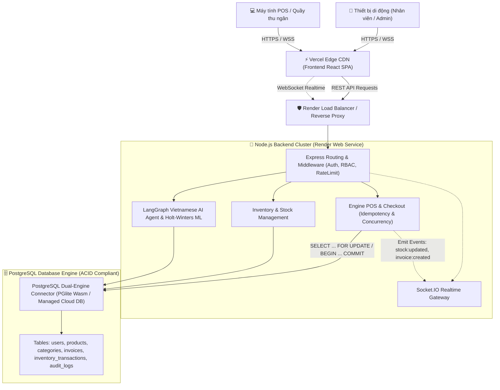

# Tài Liệu Kỹ Thuật Hệ Thống Quản Lý Tạp Hóa & POS (Grocery Store Management System)

Chào mừng bạn đến với bộ tài liệu kỹ thuật chi tiết của hệ thống **Grocery Store POS & Management System**. Bộ tài liệu này cung cấp cái nhìn toàn diện từ kiến trúc cơ sở dữ liệu, các thuật toán kiểm soát tương tranh, mô hình AI/ML đến chi tiết từng API và hướng dẫn triển khai Production.

---

## 📑 Mục Lục Tài Liệu

| STT | File Tài Liệu | Nội Dung Chính |
|:---|:---|:---|
| 01 | [01_DATABASE_ARCHITECTURE.md](./01_DATABASE_ARCHITECTURE.md) | Kiến trúc dữ liệu PostgreSQL, Dual-Engine (PGlite/Cloud), DDL Schema, Ràng buộc ACID & Chỉ mục Index |
| 02 | [02_AUTHENTICATION_RBAC.md](./02_AUTHENTICATION_RBAC.md) | Cơ chế xác thực Argon2id, JWT Rotation, Phân quyền đa cấp RBAC, Chống Brute-force |
| 03 | [03_PRODUCTS_CATEGORIES_QR.md](./03_PRODUCTS_CATEGORIES_QR.md) | Quản lý danh mục, Danh mục sản phẩm, Cơ chế sinh mã và giải mã QR Token an toàn |
| 04 | [04_INVENTORY_MANAGEMENT.md](./04_INVENTORY_MANAGEMENT.md) | Nghiệp vụ nhập hàng, Kiểm kê điều chỉnh kho, Cảnh báo tồn kho tối thiểu, Lịch sử biến động kho |
| 05 | [05_POS_CONCURRENCY_CONTROL.md](./05_POS_CONCURRENCY_CONTROL.md) | Thuật toán khóa dòng `SELECT FOR UPDATE`, Chống Deadlock, Header `Idempotency-Key` & Socket.IO |
| 06 | [06_INVOICE_FINANCIAL_MANAGEMENT.md](./06_INVOICE_FINANCIAL_MANAGEMENT.md) | Hóa đơn bất biến, Chiết khấu, Nghiệp vụ sửa hóa đơn có kiểm toán cho Super Admin |
| 07 | [07_AUDIT_LOGGING_SYSTEM.md](./07_AUDIT_LOGGING_SYSTEM.md) | Hệ thống Audit Log bất biến, Ghi vết Before/After (JSONB), Địa chỉ IP, User-Agent |
| 08 | [08_ANALYTICS_DASHBOARD.md](./08_ANALYTICS_DASHBOARD.md) | Báo cáo doanh số theo giờ, Biểu đồ doanh thu 7 ngày/30 ngày/năm, Tổng hợp chỉ số KPI |
| 09 | [09_AI_LANGGRAPH_ASSISTANT.md](./09_AI_LANGGRAPH_ASSISTANT.md) | Trợ lý AI LangGraph tiếng Việt, Xử lý ngôn ngữ tự nhiên thời gian, Kiến trúc Tool-Calling Agent |
| 10 | [10_AI_REVENUE_FORECASTING.md](./10_AI_REVENUE_FORECASTING.md) | Mô hình toán học ML Holt-Winters dự báo doanh thu, Đánh giá sai số MAPE/RMSE & Khoảng tin cậy 95% |
| 11 | [11_FRONTEND_REACT_SPA.md](./11_FRONTEND_REACT_SPA.md) | Kiến trúc React SPA, Mobile-First POS, Quét QR qua Camera, Giỏ hàng cảm ứng & In Bill nhiệt |
| 12 | [12_DEPLOYMENT_DEVOPS.md](./12_DEPLOYMENT_DEVOPS.md) | Hướng dẫn triển khai Production lên Render (Backend + DB) và Vercel (Frontend), CI/CD |
| 13 | [13_API_REFERENCE_TESTS.md](./13_API_REFERENCE_TESTS.md) | Danh mục toàn bộ REST API Endpoints, Quy ước mã lỗi HTTP và Bộ kiểm thử tự động 22 bài |
| 14 | [14_MOBILE_RESPONSIVENESS_AND_SMART_CODE.md](./14_MOBILE_RESPONSIVENESS_AND_SMART_CODE.md) | Tối ưu hóa giao diện di động toàn diện & Thuật toán tự sinh mã sản phẩm kèm kiểm tra trùng lặp thời gian thực |

---

## 🏛️ Sơ Đồ Tổng Quan Kiến Trúc Hệ Thống (High-Level Architecture)

---

## ⚙️ Công Nghệ Chủ Đạo (Tech Stack)

### 1. Backend:
- **Ngôn ngữ & Môi trường**: Node.js (v18+ / v20+), Express.js.
- **Cơ sở dữ liệu**: PostgreSQL 16 / ElectricSQL PGlite (Wasm local development & isolated testing).
- **Mã hóa & Xác thực**: Argon2id (`argon2`) / Bcrypt, JSON Web Token (`jsonwebtoken`).
- **Giao tiếp thời gian thực**: Socket.IO (`socket.io`).
- **Xử lý AI / ML**:
  - LangChain & LangGraph (`@langchain/langgraph`, `@langchain/core`).
  - Phân tích chuỗi thời gian: Triple Exponential Smoothing (Holt-Winters Seasonality & Trend Decomposition).

### 2. Frontend:
- **Framework**: React 19, React Router DOM v7.
- **Build Tool**: Vite, ESBuild.
- **Iconography & Trực quan hóa**: Lucide React, Chart.js (`react-chartjs-2`).
- **Quét mã & In ấn**: `html5-qrcode` (HTML5 Camera Barcode & QR Scanner), Canvas Confetti.
- **Thiết kế**: Mobile-First CSS System, CSS Custom Properties (Theme Glassmorphism, Clean Dashboard).

---

## 🔒 Các Tiêu Chí Bảo Mật & An Toàn Dữ Liệu
1. **Zero Overselling**: Sử dụng khóa dòng cấp cơ sở dữ liệu (`SELECT ... FOR UPDATE`) kết hợp ràng buộc `CHECK (stock_quantity >= 0)`.
2. **Idempotency**: Ngăn chặn tình trạng mạng chậm người dùng click 2 lần dẫn đến trừ tiền hoặc trừ kho 2 lần.
3. **Audit Compliance**: Mọi hành vi tạo, sửa, xóa, kiểm kê, hoàn tiền đều được ghi nhận vào bảng `audit_logs` bất biến.
4. **Không Hallucination**: AI trả lời số liệu dựa trên các Tool truy vấn trực tiếp từ cơ sở dữ liệu, không cho phép AI tự suy đoán dữ liệu kinh doanh.
